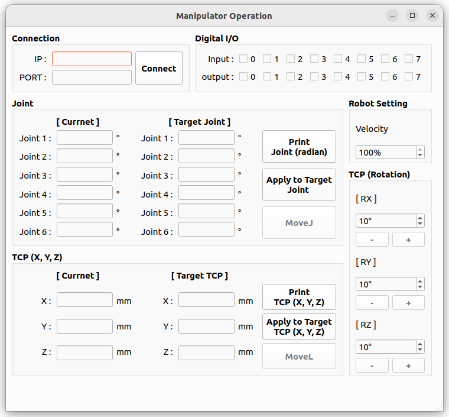

# Manipulator Operation

## 📁 Project Structure

```
Manipulator_operation/
├── build/                          # Build output directory
│   └── debug/                      # Debug build
├── KETIRobotSDK/                   # Robot SDK directory
│   ├── ...
│   ├── robotconf.h                 # Robot configuration header
│   └── sdkv2.h                     # Robot SDK header
├── Dockerfile                      # Docker build configuration
├── docker-compose.yml              # Docker Compose configuration
├── docker-run.sh                   # Docker management & build/run script
├── main.cpp                        # Program entry point
├── mainwindow.h / .cpp             # Main window implementation
├── mainwindow.ui                   # Qt Designer UI file
├── setting_config.h / .cpp         # Configuration management
├── Manipulator_operation.pro       # Qt project file
└── README.md                       # Project documentation
```

## 🔧 Environment & Installation

### 🐳 Docker Environment Setup

<details>
<summary>Docker Environment Guide</summary>

#### 1. Pull Docker Image

```bash
sudo docker pull hhanoo/keti:manipulator-operation
```

#### 2. Run Docker Container using Docker Compose

```bash
cd ~/POC_SFSC--cert2
./docker-run-cuda.sh [COMMAND]
```

> ### Options
>
> | Command   | Description                                |
> | --------- | ------------------------------------------ |
> | `build`   | 🔨 Build Manipulator Operation Application |
> | `run`     | 🤖 Run Manipulator Operation GUI           |
> | -         |                                            |
> | `start`   | 🟢 Start Docker Container                  |
> | `stop`    | 🔴 Stop Docker Container                   |
> | `restart` | 🔄 Restart Docker Container                |
> | `logs`    | 📋 Check Docker Logs                       |
> | `status`  | 📊 Check Container Status                  |
> | `shell`   | 🐚 Access Docker Container (bash shell)    |
> | `exit`    | ❌ Exit                                    |

</details>

## 🚀 Usage

### 🐳 Docker

#### 1. Start Services

```bash
# Start all services in background
./docker-run.sh start
```

#### 2. Build Application

```bash
# Build the application
./docker-run.sh build
```

#### 3. Run Application

```bash
# Run the GUI application
./docker-run.sh run
```

### 📦 QT

#### 1. Open project

```bash
# Open project file in Qt Creator
qtcreator Manipulator_operation.pro
```

#### 2. Build Application (Manually)

```bash
# Build manually
qmake Manipulator_operation.pro
make
```

#### 3. Run Application (Maually)

```bash
# Run manually
./Manipulator_operation
```

## ✨ Main Features

- **Robot Connection/Disconnection**: TCP/IP-based robot communication
- **Joint Control**: Real-time monitoring and control of 6-axis joint values
- **Kinematics Control**: Position/orientation-based linear/joint movement
- **TCP Rotation Control**: RX, RY, RZ axis rotation with +/- buttons
- **Digital I/O**: 8-channel digital input/output control
- **Real-time Monitoring**: 50ms cycle status updates
- **Velocity Control**: Adjustable robot movement speed (1-100%)

## ⚙️ Configuration

### 1. Dependencies

- TCP/IP socket-based architecture
- Robot SDK: KETIRobotSDK
- Qt 6.7.x GUI framework
- Eigen 3.x
- Docker & Docker Compose (for containerized development)

## 📝 Notes

- Ensure robot is powered on and network accessible
- X11 forwarding must be enabled for GUI in Docker

## 🖥️ Screen Shot


