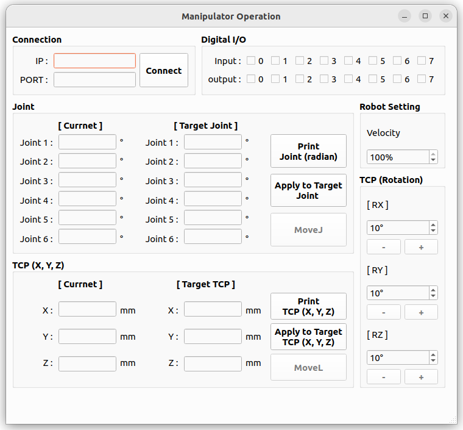

# Manipulator Manager

**Qt 기반 6축 매니퓰레이터 실시간 제어 및 모니터링 GUI 시스템**

[](https://isocpp.org/)
[](https://www.qt.io/)
[](docker/)
[](LICENSE)

---

## 목차

- [데모](#데모)
- [개요](#개요)
- [주요 기능](#주요-기능)
- [시스템 구조](#시스템-구조)
- [프로젝트 구조](#프로젝트-구조)
- [빠른 시작](#빠른-시작)
- [시스템 요구사항](#시스템-요구사항)
- [설치](#설치)
- [빌드](#빌드)
- [실행](#실행)
- [사용법](#사용법)
- [설정](#설정)
- [API / 인터페이스](#api--인터페이스)
- [문제 해결](#문제-해결)
- [라이선스](#라이선스)
- [Maintainer](#maintainer)

---

## 데모

<details>
<summary>UI 인터페이스</summary>



</details>

---

## 개요

### 프로젝트 목적

Manipulator Manager는 KETI Robot SDK를 활용하여 6축 산업용 매니퓰레이터를 실시간으로 제어하고 모니터링하는 Qt 기반 GUI 애플리케이션입니다. TCP/IP 통신을 통해 로봇과 연결하며, 관절 제어, 기구학 제어, 디지털 I/O 제어 등 로봇 운용에 필요한 핵심 기능을 제공합니다.

### 주요 구성요소

- **KETIRobotSDK** (C++): KETI 로봇 통신 SDK ([GitHub](https://github.com/robot-plus-program/ketirobotsdk))
- **MainWindow** (C++ / Qt): 로봇 제어 및 모니터링 GUI
- **SettingConfig** (C++ / Qt): 연결 설정 및 구성 파일 관리

### 적용 가능 영역

- 산업용 매니퓰레이터 수동 제어 및 티칭
- 로봇 관절값 및 TCP 포즈 실시간 모니터링
- 디지털 I/O 기반 주변 장치 제어
- 로봇 SDK 테스트 및 디버깅
- 연구 개발 및 교육

---

## 주요 기능

- **로봇 연결/해제**: TCP/IP 기반 로봇 통신 연결 및 상태 관리
- **관절 제어**: 6축 관절값 실시간 모니터링 및 MoveJ 제어
- **기구학 제어**: X/Y/Z 위치 기반 MoveL (직선 이동) 제어
- **TCP 회전 제어**: RX, RY, RZ 축 +/- 버튼을 통한 TCP 회전
- **디지털 I/O**: 8채널 디지털 입출력 모니터링 및 제어
- **실시간 모니터링**: 50ms 주기 상태 업데이트
- **속도 제어**: 로봇 이동 속도 조절 (1-100%)
- **설정 저장/로드**: config.ini를 통한 연결 정보 자동 저장

---

## 시스템 구조

```
    6-Axis Manipulator (UR10, RB10, M1013, Indy7, Hyundai)
              │
              │ TCP/IP
              ▼
    ┌──────────────────────┐
    │ KETIRobotSDK         │ (C++)
    │ - Robot communication│
    │ - Joint/Pose control │
    │ - Digital I/O        │
    └──────────┬───────────┘
               │ SDK API
               ▼
    ┌──────────────────────┐
    │ Manipulator Manager  │ (C++ / Qt 6)
    │ - GUI Interface      │
    │ - Real-time monitor  │
    │ - Joint/Kinematics   │
    │ - Digital I/O panel  │
    └──────────────────────┘
```

---

## 프로젝트 구조

```
Manipulator_manager/
├── KETIRobotSDK/                  # Robot SDK 라이브러리
│   ├── librobotsdk.so             # 공유 라이브러리
│   ├── sdkv2.h                    # SDK 헤더
│   └── robotconf.h                # 로봇 설정 헤더
├── docker/                        # Docker 지원
│   ├── Dockerfile                 # Docker 이미지 빌드 설정
│   ├── build.sh                   # 이미지 빌드 스크립트
│   ├── run.sh                     # 컨테이너 실행 스크립트
│   └── config.sh.example          # 설정 템플릿
├── docs/                          # 문서
│   └── preview.png                # GUI 스크린샷
├── main.cpp                       # 프로그램 진입점
├── mainwindow.h / .cpp            # 메인 윈도우 구현
├── mainwindow.ui                  # Qt Designer UI 파일
├── setting_config.h / .cpp        # 설정 관리
├── Manipulator_manager.pro        # Qt 프로젝트 파일
└── README.md
```

---

## 빠른 시작

### Option 1: Docker (권장)

```bash
# 0. 프로젝트 루트로 이동
cd Manipulator_manager/docker

# 1. Docker 이미지 빌드
./build.sh

# 2. 컨테이너 실행
./run.sh

# 3. 컨테이너 내에서 빌드 및 실행
cd /root/workspace/Manipulator_manager
mkdir -p build && cd build
/opt/Qt/6.7.0/gcc_64/bin/qmake ../Manipulator_manager.pro
make && ./Manipulator_manager
```

### Option 2: Native

```bash
# 0. 프로젝트 루트로 이동
cd Manipulator_manager

# 1. 의존성 설치
sudo apt install -y libeigen3-dev libcurl4-openssl-dev libgl-dev

# 2. 빌드 및 실행
mkdir -p build && cd build
qmake ../Manipulator_manager.pro
make && ./Manipulator_manager
```

---

## 시스템 요구사항

### 필수

| 항목 | 요구사항         |
| ---- | ---------------- |
| OS   | Ubuntu 22.04 LTS |
| 언어 | C++17 (GCC 9+)   |

### 하드웨어

| 항목    | 사양                                    | 비고                           |
| ------- | --------------------------------------- | ------------------------------ |
| Network | 로봇과 TCP/IP 통신 가능한 네트워크 환경 | 유선 이더넷 권장               |
| Display | X11 디스플레이                          | Docker 사용 시 X11 포워딩 필요 |

### 소프트웨어 의존성

- Qt 6.7.x
- libeigen3-dev
- libcurl4-openssl-dev
- libgl-dev, libvulkan-dev
- ninja-build, cmake

### 외부 패키지

| 패키지       | 출처                                                         | 용도                            |
| ------------ | ------------------------------------------------------------ | ------------------------------- |
| KETIRobotSDK | [GitHub](https://github.com/robot-plus-program/ketirobotsdk) | 로봇 통신 SDK (프로젝트에 포함) |

---

## 설치

### Method 1: Docker (권장)

```bash
# 0. 프로젝트 루트로 이동
cd Manipulator_manager/docker

# 1. 설정 파일 생성
cp config.sh.example config.sh

# 2. Docker 이미지 빌드
./build.sh

# 3. 컨테이너 실행
./run.sh
```

### Method 2: Native

#### 1. 저장소 클론

```bash
git clone <repository-url>
cd Manipulator_manager
```

#### 2. 시스템 의존성 설치

```bash
sudo apt update
sudo apt install -y \
  libgl-dev \
  libvulkan-dev \
  ninja-build \
  cmake \
  bear \
  libeigen3-dev \
  libcurl4-openssl-dev
```

#### 3. Qt 6.7 설치

Qt 공식 설치 도구를 사용하거나 `aqt`로 설치:

- [Qt Online Installer](https://www.qt.io/download)

---

## 빌드

### 전체 빌드

```bash
mkdir -p build && cd build
qmake ../Manipulator_manager.pro
make
```

### 전체 빌드 (Docker)

```bash
mkdir -p build && cd build
/opt/Qt/6.7.0/gcc_64/bin/qmake ../Manipulator_manager.pro
make
```

### 클린 빌드

```bash
cd build
make clean
qmake ../Manipulator_manager.pro
make
```

---

## 실행

### 전체 시스템 실행

```bash
cd build
./Manipulator_manager
```

### Docker 실행

```bash
# Docker 컨테이너 실행
cd docker
./run.sh

# 컨테이너 내부에서
cd /root/workspace/Manipulator_manager/build
./Manipulator_manager
```

---

## 사용법

### 워크플로우

```
로봇 연결 ───────▶ 상태 모니터링 ─────────▶ 로봇 제어
  │                  │                    │
 IP/Port 입력      관절값/TCP 확인      MoveJ/MoveL/I/O
```

### 단계 1: 로봇 연결

```
GUI에서 로봇 IP 주소와 포트 입력 후 Connect 버튼 클릭
연결 성공 시 상태 표시 변경 및 제어 버튼 활성화
```

### 단계 2: 상태 모니터링

```
Current Joint 영역에서 6축 관절값 실시간 확인 (단위: deg)
TCP [X, Y, Z] 영역에서 TCP 위치 실시간 확인 (단위: mm)
Print 버튼으로 현재 관절값/변환행렬 콘솔 출력
```

### 단계 3: 로봇 제어

```
MoveJ: Target Joint에 목표 관절값 입력 → Apply → MoveJ 클릭
MoveL: Target TCP에 목표 위치 입력 → Apply → MoveL 클릭
TCP 회전: RX/RY/RZ +/- 버튼으로 TCP 회전 제어
디지털 I/O: 체크박스로 8채널 출력 On/Off, 입력 상태 모니터링
```

---

## 설정

### Docker 설정

[config.sh.example](docker/config.sh.example)을 `config.sh`로 복사하여 편집합니다.

| 파라미터         | 기본값                | 설명                 |
| ---------------- | --------------------- | -------------------- |
| `IMAGE_NAME`     | `manipulator-manager` | Docker 이미지 이름   |
| `CONTAINER_NAME` | `manipulator-manager` | Docker 컨테이너 이름 |

### config.ini

애플리케이션 설정은 `build/config.ini`에 자동 저장/로드됩니다.

```ini
[General]
ROBOT_IP=127.0.0.1
ROBOT_PORT=5005
ROBOT_VELOCITY=100
TCP_RX_DEG=10
TCP_RY_DEG=10
TCP_RZ_DEG=10
```

### 주요 파라미터 설명

- **ROBOT_IP**: 로봇 TCP/IP 연결 주소
- **ROBOT_PORT**: 로봇 TCP/IP 연결 포트
- **ROBOT_VELOCITY**: 로봇 이동 속도 (1-100%)
- **TCP_RX/RY/RZ_DEG**: TCP 회전 증분값 (단위: deg)

---

## API / 인터페이스

### SDK API

| 메서드                        | 설명                        |
| ----------------------------- | --------------------------- |
| `SetRobotConf(index, ip, port)` | 로봇 연결 설정            |
| `RobotConnect()`              | 로봇 연결                   |
| `RobotDisconnect()`           | 로봇 연결 해제              |
| `RobotInfo()`                 | 현재 상태 조회 (관절, 포즈) |
| `movej(pnt)`                  | 관절 이동 (MoveJ)           |
| `movel(ref, pnt)`             | 직선 이동 (MoveL)           |
| `SetVelocity(v)`              | 이동 속도 설정 (1-100%)     |
| `Stop()`                      | 긴급 정지                   |
| `WaitMove()`                  | 이동 완료 대기              |
| `ControlBoxDigitalOut(out)`   | 디지털 출력 제어 (8bit)     |
| `ControlBoxDigitalIn()`       | 디지털 입력 조회 (8bit)     |

### 지원 로봇

| 로봇    | 타입 ID | 비고 |
| ------- | ------- | ---- |
| UR10    | 2       | 기본 |
| RB10    | 1       |      |
| M1013   | 3       |      |
| Indy7   | 4       |      |
| Hyundai | 5       |      |

### 네트워크 구성

| 항목     | 값               | 설명                     |
| -------- | ---------------- | ------------------------ |
| Protocol | TCP/IP           | 로봇-PC 간 통신 프로토콜 |
| Port     | 5005 (기본)      | 로봇 SDK 통신 포트       |
| Docker   | `--network host` | 호스트 네트워크 공유     |

---

## 문제 해결

### 1. Docker 컨테이너에서 GUI가 표시되지 않음

증상:

```
cannot open display
```

해결:

```bash
# X11 포워딩 활성화 확인
xhost +local:docker

# DISPLAY 환경변수 확인
echo $DISPLAY

# run.sh가 X11 설정을 자동으로 처리하므로 ./run.sh 사용 권장
```

### 2. libeigen3-dev not found

증상:

```
fatal error: Eigen/Dense: No such file or directory
```

해결:

```bash
sudo apt update
sudo apt install -y libeigen3-dev
```

### 3. Qt 라이브러리를 찾지 못함

증상:

```
qmake: command not found
```

해결:

```bash
# Qt 설치 경로 확인
ls /opt/Qt/

# Docker 내에서는 아래 경로 사용
/opt/Qt/6.7.0/gcc_64/bin/qmake ../Manipulator_manager.pro
```

### 4. 로봇에 연결되지 않음

증상:

```
연결 버튼 클릭 후 응답 없음
```

해결:

```bash
# 1. 로봇 전원 및 네트워크 확인
ping <robot-ip>

# 2. 포트 접근 확인
nc -zv <robot-ip> 5005

# 3. 방화벽 설정 확인
sudo ufw status
```

---

## 라이선스

이 프로젝트는 Apache License 2.0 라이선스로 배포됩니다. 자세한 내용은 [LICENSE](LICENSE) 파일을 참조하세요.

> **참고**: `KETIRobotSDK/` 내 바이너리 파일(`.so`, `.a`)은 별도의 라이선스 조건이 적용될 수 있습니다.

---

## Maintainer

hhanoo (woo980711@gmail.com)
